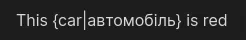

  

<h1 align="center">
  Memodack (Obsidian Plugin)
</h1>

### Description

This plugin will help you to be better in other languages.

### Syntax

Translation hiding only in Reading

`{value|translation}`

### Practice

For practice, open a document and click on the 🦆 icon in the left ribbon menu, or search for `Memodack` in the command palette.

If you want to practice all the words in the document, just enable Reading mode and select what you need. If a word is not fully highlighted, it will still be selected!

### Settings

In the settings, you can select languages and chose the [Server](server/README.md).

### Hotkeys

For a quick translation and to convert a word to plugin syntax, find the command `Memodack: Translate` and set a hotkey, for example, `Alt+T`.

After translation, text-to-speech will be called for the word and its translation.

### Cache

After text-to-speech, the text result will be saved to the cache at the path below.

`.obsidian/plugins/memodack/cache`
