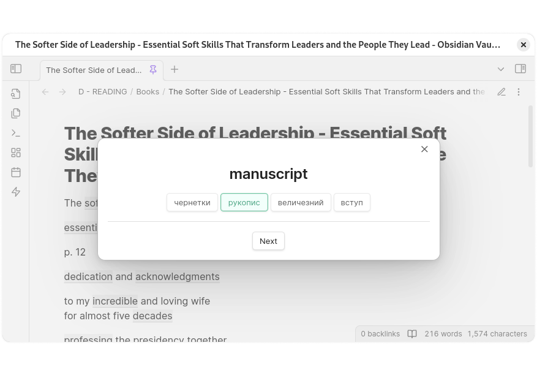

  

<h1 align="center">
  Memodack
   
  Obsidian Plugin
</h1>

### Description

We all know paid services like [Quizlet](https://quizlet.com/), [Readlang](https://readlang.com/), or free ones like [Anki](https://apps.ankiweb.net/). [Memodack](https://github.com/pavlokobyliatskyi/obsidian-memodack-plugin) offers something similar, but much simpler and focused exclusively on memorizing words or phrases. Study whenever it suits you and without any
limitations.

### Installation

1. Launch Obsidian.
2. Navigate to `Settings` > `Community Plugins`.
3. Search for "Memodack".
4. Install and enable the plugin.

### Syntax

The plugin has its own syntax.

`{value|translation}`

On the left, there can be a word or phrase, and on the right, the translation. If there is more than one translation, they can be listed separated by commas.

`{some value|translation, translation, translation, ...}`

All translations will be considered as one.

In reading mode, the translation will be hidden, and the word will be highlighted with specific styles.

### Hotkeys

For a quick translation and to convert a word (phrase) to plugin syntax, select what you need and press `Alt+T`. After translation, text-to-speech will be called for the word and its translation.

`car` -> `{car|автомобіль}`

In the settings hotkeys find the command `Memodack: Translate` and set a hotkey, for example, `Alt+T`.

### Practice

For practice, open a document and click on the flash icon in the left ribbon menu, or search for `Memodack` in the command palette.

If you don't want to practice all the words in the document, just enable Reading mode and select what you need. If a word is not fully highlighted, it will still be selected!

### Settings

In the settings, you can select languages and chose the [Server](server/README.md), etc.

### Cache

After text-to-speech, the text result will be saved to the cache at the path below.

`.obsidian/plugins/memodack/cache`
