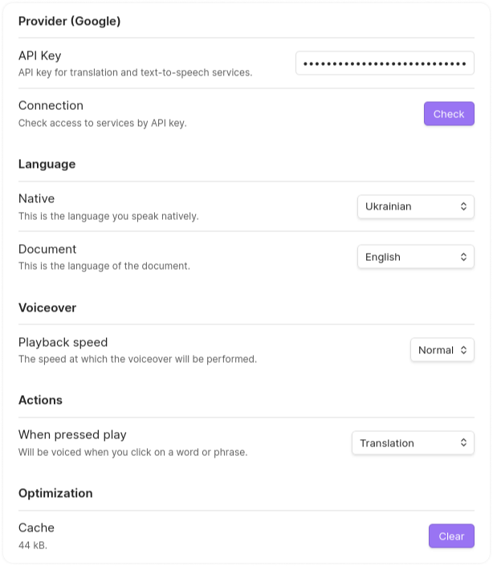

  

<h1 align="center">
  Memodack (Obsidian Plugin)
</h1>

### Description

This plugin will help you to be better in other languages. For a better understanding, watch a [demo](https://youtu.be/XK10tU6j4Vo)

### Syntax

Translation hiding only in Reading

`(word|translation)`

### Practice

For practice, open a document and click on the 🦆 icon in the left ribbon menu, or search for `Memodack` in the command palette.

### Cache

After text-to-speech, the text result will be saved to the cache at the path below

`.obsidian/plugins/memodack/cache`

### Settings

In the settings, you can select `Source` and `Target` languages

### Hot Keys

For a quick translation and to convert a word to plugin syntax, select the text and press `Alt+T` or `Option+T`

After translation, text-to-speech will be called for the word and its translation

### Free?

The plugin uses a free API for translations and text-to-speech! Text-to-speech works only on desktop. If you want to listen on mobile, you need to sync your data, as the cache will sync as well, allowing you to play the text
